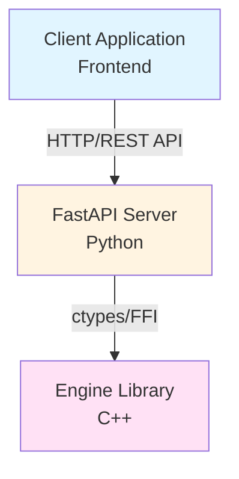
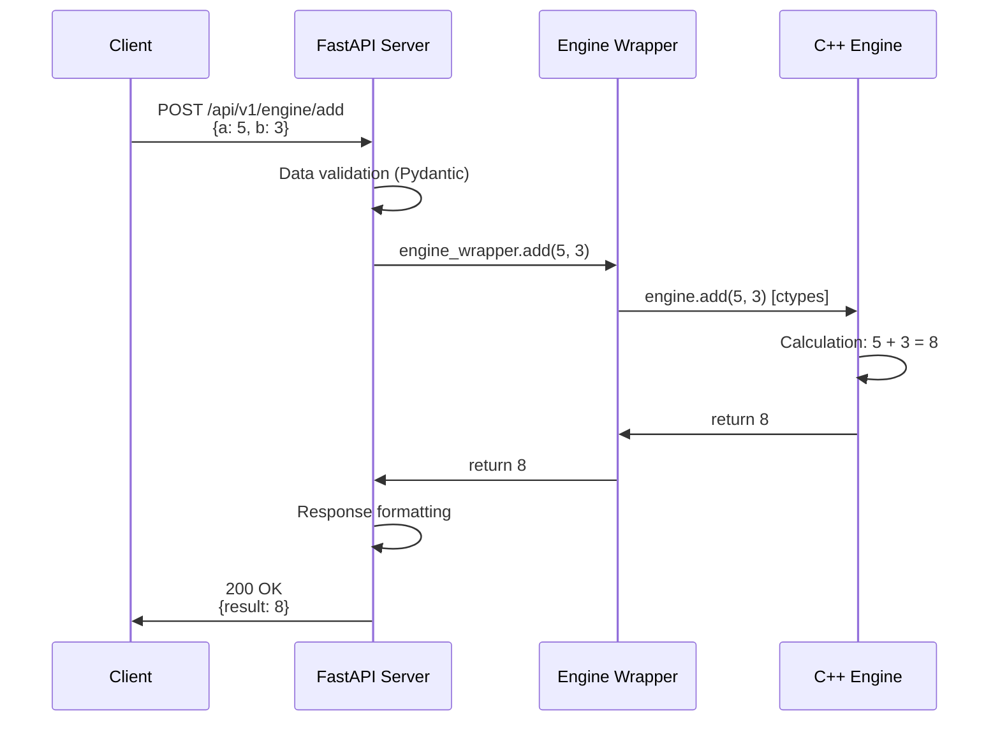

# System Architecture

## Architecture Overview

ModelSLab uses a three-layer architecture with clear separation of responsibilities between components.

## Architecture Diagram



## System Layers

### 1. Presentation Layer (Client)

**Status**: Prepared for future implementation

**Technologies**: (to be chosen)

- React / Vue / Angular
- TypeScript
- Modern CSS framework

**Responsibilities**:

- User interface
- API communication
- Data presentation

### 2. Application Layer (Server)

**Technologies**:

- FastAPI (Python)
- Uvicorn (ASGI server)
- Pydantic (validation)

**Responsibilities**:

- HTTP request handling
- Input data validation
- Routing and business logic
- C++ library integration
- API documentation generation

**Structure**:

```
server/
├── main.py              # Application entry point
├── app/
│   ├── core/            # Configuration
│   ├── models/          # Pydantic models
│   ├── routers/         # API endpoints
│   └── engine_wrapper.py # C++ wrapper
```

### 3. Computational Layer (Engine)

**Technologies**:

- C++ (C++11+)
- CMake (build system)
- ctypes (Python ↔ C++ interface)

**Responsibilities**:

- Mathematical computation execution
- Data processing
- High-performance numerical operations

**Structure**:

```
engine/
├── engine.h             # Library interface
├── engine.cpp           # Implementation
└── CMakeLists.txt       # Build configuration
```

## Data Flow

### Example: Adding Numbers



## Inter-layer Communication

### Client ↔ Server

**Protocol**: HTTP/REST

**Data Format**: JSON

**Endpoints**:

- `/api/v1/users/*` - User management
- `/api/v1/items/*` - Item management
- `/api/v1/engine/*` - Computational operations

### Server ↔ Engine

**Mechanism**: ctypes (Foreign Function Interface)

**Data Format**: Native C++ types (int, double, char\*)

**Wrapper**: `app/engine_wrapper.py`

```python
# Usage example
from ctypes import cdll
engine_lib = cdll.LoadLibrary("engine.dll")
result = engine_lib.add(5, 3)
```

## Security

### Current Security Measures

- ✅ Input data validation (Pydantic)
- ✅ CORS middleware
- ✅ Health check endpoints

### To Be Implemented

- ⚠️ Password hashing
- ⚠️ Authentication and authorization
- ⚠️ Rate limiting
- ⚠️ HTTPS in production

## Scalability

### Current Architecture

- **Storage**: In-memory (data lost on restart)
- **Concurrency**: Async FastAPI (Uvicorn)
- **Load balancing**: Not implemented

### Production Recommendations

1. **Database**: PostgreSQL / SQLite
2. **Cache**: Redis
3. **Load balancer**: Nginx / Traefik
4. **Monitoring**: Prometheus + Grafana
5. **Logging**: Structured logging (JSON)

## Extensibility

The project has been designed with easy expansion in mind:

- **Modular structure** - Easy to add new endpoints
- **Separation of concerns** - Clean code
- **Documentation** - Facilitates onboarding of new developers
- **Tests** - (To be implemented) Unit and integration tests

## Next Steps

- [Quick Start](quickstart.md) - Set up the environment
- [Engine Documentation](../engine/index.md) - Learn about the C++ library
- [Server Documentation](../server/index.md) - Learn about the API

